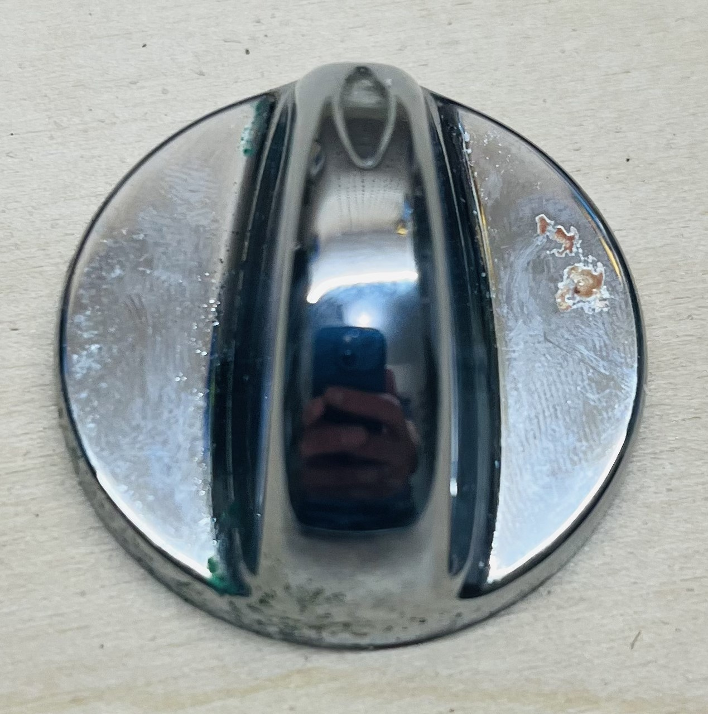
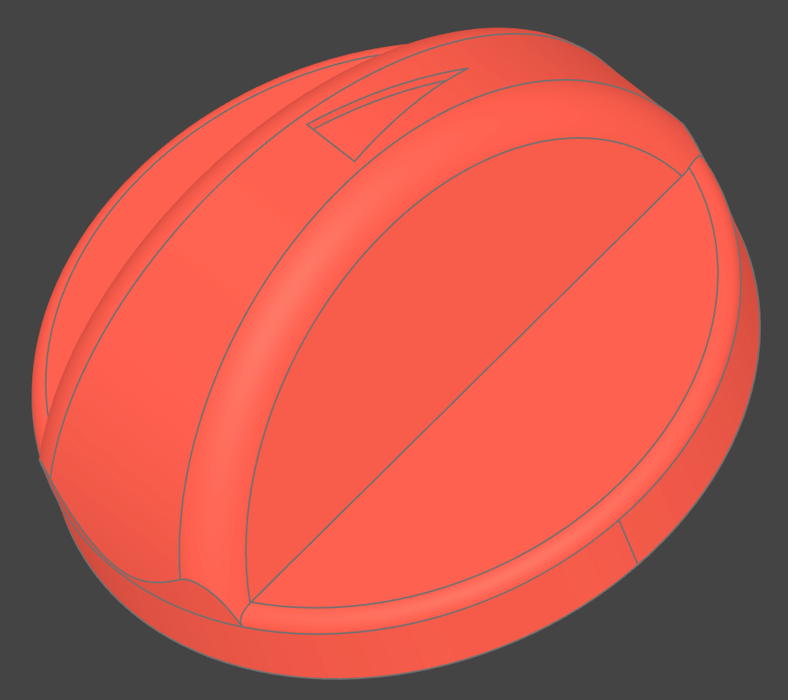

# D-Shaft Knob

A parametric CAD model of a D-shaft control knob, built with [build123d](https://build123d.readthedocs.io/). The part is a push-on knob with a D-shaped bore sized for a 7 mm shaft and an engraved triangular home-position marker on the top surface.

<p align="center">
  
  
</p>

## Model source

The single source of truth is [`main.py`](main.py). All dimensions (base size, grip taper, socket, marker) are top-level parameters at the top of the file — edit them there, then regenerate the models.

## Generating the STL / STEP files

Run from this directory:

```bash
uv run main.py
```

This writes:

- `build/d_shaft_knob.step` — CAD exchange format
- `build/d_shaft_knob.stl` — for slicing / 3D printing

The script also opens a live 3D viewer (via `ocp_vscode`) with the finished knob and the toggleable construction components (base, grip, home-marker cut).

## Printing

Print with the flat base face on the bed (Z=0 down). No supports needed.

## Orientation notes

- **Z** is vertical; the flat base bottom sits at `Z=0`.
- **+Y** is the home-marker end: the triangle marker points toward `+Y`.
- **−Y** is the far end of the grip; the D-shaft flat faces `−Y`, opposite the marker.
- If the printed socket is too tight or loose, adjust `socket_clearance` in `main.py` (larger = looser fit).